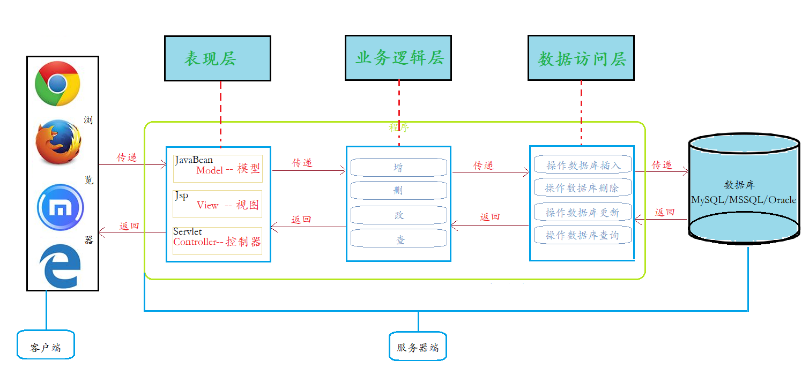

## 绿色设计

​	在产品整个生命周期内，着重考虑产品环境属性(可拆卸性，可回收性，可维护性，可重复利用性等)，并将其作为设计目标，在满足环境目标要求的同时，保证产品应有的功能、使用寿命、质量等要求。

​	软件工程中，对象之间的耦合度就是对象之间的依赖性，对象之间的耦合度越改，维护成本越高。

解耦即可以理解为降低耦合度。

​	架构的目的就是为了实现软件的模块化，高内聚、低耦合。

## B/S与C/S架构

​	C/S架构，即 Client/Server(客户机/服务机)结构。通过将任务合理分配到 Client 端和 Server 端，可以充分利用两端硬件优势，实现资源的共享。一般指的是2-tier结构。

​	B/S架构，即 Browser/Server(客户机/服务机)结构。随着 Internet 技术兴起，对 C/S 结构的一种变化和改进的结构。一般指的是3-tier结构。

​	C/S 与 B/S 的概念更偏向于物理层的的划分。

 

## 三层架构与MVC

​	在 B/S 结构中，浏览器负责发出和相应请求，数据库服务器负责接受查询并返回查询结果。这样导致所有的运算处理都集中在web服务器端。为此，我们将web端的事务根据逻辑进行分割，即三层架构。

​	三层结构，指的是界面层(UIL)、业务逻辑层(BLL)、数据访问层(DAL)。

​	

