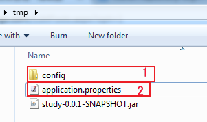
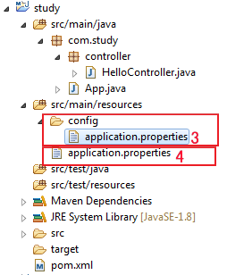

[toc]

## Springboot 配置

spring.profiles.active：切换启动使用的配置

[获取属性application中属性](https://www.cnblogs.com/Amywangqing/p/12896805.html)

[Springboot yml获取系统环境变量的值](https://blog.csdn.net/tianyaleixiaowu/article/details/76019814)

```yaml
#指定端口号
server.port=8090
#指定context path
server.servlet.context-path=/test
```

### 配置文件位置

application.properties一共有四个目录可以放置。

1. 外置，在相对于应用程序运行目录的/congfig子目录里
2. 外置，在应用程序运行的目录里
3. 内置，在config包内
4. 内置，在classpath根目录

配置文件的优先级是 1 > 2 > 3 >4



## Springboot 热部署

yml:

```
spring.devtools.restart.enabled=true
```

pom:

        <!-- spring-boot-devtools -->
        <dependency>
            <groupId>org.springframework.boot</groupId>
            <artifactId>spring-boot-devtools</artifactId>
            <optional>true</optional> <!-- 表示依赖不会传递 -->
        </dependency>
## Spring 应用监控Actuator

Actuator是Spring Boot提供的对应用系统的监控和管理的集成功能，可以查看应用配置的详细信息，例如自动化配置信息、创建的Spring beans信息、系统环境变量的配置信以及Web请求的详细信息等。

### 使用

Actuator应用监控使用只需要添加spring-boot-starter-actuator依赖即可，如下：

```xml
<dependency>
    <groupId>org.springframework.boot</groupId>
    <artifactId>spring-boot-starter-actuator</artifactId>
</dependency>
```

配置文件application.yml

```yaml
# ============================= actuator监控 ============================= #
management:
  endpoints:
    enabled-by-default: true # 设置端点是否可用 默认只有shutdown可用
    web:
      # 设置是否暴露端点 默认只有health和info可见
      exposure:
        # include: env   # 方式1: 暴露端点 env 配置多个,隔开
        include: "*"     # 方式2: 包括所有端点, 注意需要添加引号
        # 排除端点
        exclude: shutdown
```


Actuator监控分成两类：原生端点和用户自定义扩展端点，原生的主要有：

| 路径         | 描述                                                         |
| ------------ | ------------------------------------------------------------ |
| /conditions  | 提供了一份自动配置报告，记录哪些自动配置条件通过了，哪些没通过 |
| /beans       | 描述应用程序上下文里全部的Bean，以及它们的关系               |
| /env         | 获取全部环境属性                                             |
| /configprops | 描述配置属性(包含默认值)如何注入Bean                         |
| /dump        | 获取线程活动的快照                                           |
| /health      | 报告应用程序的健康指标，这些值由HealthIndicator的实现类提供  |
| /info        | 获取应用程序的定制信息，这些信息由info打头的属性提供         |
| /mappings    | 描述全部的URI路径，以及它们和控制器(包含Actuator端点)的映射关系 |
| /metrics     | 报告各种应用程序度量信息，比如内存用量和HTTP请求计数         |
| /shutdown    | 关闭应用程序，要求endpoints.shutdown.enabled设置为true       |
| /trace       | 提供基本的HTTP请求跟踪信息(时间戳、HTTP头等)                 |

### 安全建议

在使用Actuator时，不正确的使用或者一些不经意的疏忽，就会造成严重的信息泄露等安全隐患。在代码审计时如果是springboot项目并且遇到actuator依赖，则有必要对安全依赖及配置进行复查。也可作为一条规则添加到黑盒扫描器中进一步把控。
 安全的做法是一定要引入security依赖，打开安全限制并进行身份验证。同时设置单独的Actuator管理端口并配置不对外网开放。

## SpringBoot 连接池

SpringBoot 2.+ 版本默认使用 HikariPool 连接池

SpringBoot 2.+ 版本使用 Druid 连接池做法：druid-spring-boot-starter中进行了默认配置

```xml
<druid-starter>
	<dependency>
	<groupId>com.alibaba</groupId>
	<artifactId>druid-spring-boot-starter</artifactId>
	<version>1.1.10</version>
</dependency>
```

## SpringBoot 日志

Spring Boot默认使用slf4j+LogBack日志系统。

## SpringBoot MVC 静态文件

spring boot默认开启了静态文件的配置，任何放在/resources/static文件夹下的资源都是静态文件。引用静态文件时以/或者前缀不加任何定位符，都会去static文件夹下查找。

注：thymeleaf模版默认会使用templatess作为视图文件下

application.yml配置文件：

1. 文件放在resources下

   >```yml
   >spring:
   >  	resources:
   >		static-locations: classpath:/templates/,classpath:/static/
   >  ```
   
2. 文件放在任意路径下

   >```yaml
   >spring:
   >  	resources:
   >		static-locations: file:D:\gzzg\springboot-example08\templates\,file:D:\gzzg\springboot-example08\static
   >  ```

## SpringBoot 问题汇总

### spring boot 配置文件配置项 数字特殊处理问题

以0b开头的数字，会被当做二进制数处理

以0x开头的数字，会被当做十六进制数处理

以0开头的数字，会被当做八进制数处理

解决方式，把该值用引号""包起来