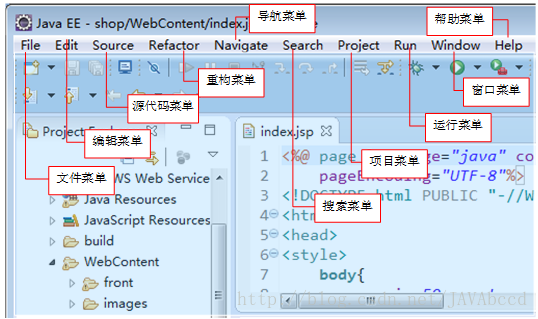
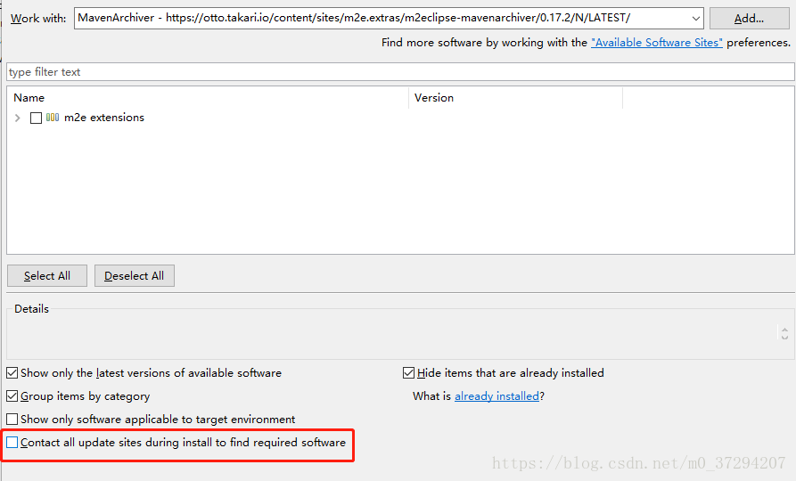

## 系统菜单




## 快捷键

路径：Window-->Preferences  |  General-->Keys


## 插件

### 1.SonarLint

## 异常处理

### 1.Maven pom.xml文件报错

eclipse新建maven项目时，pom.xml文件第一行报错：

```
org.apache.maven.archiver.MavenArchiver.getManifest(org.apache.maven.project.MavenProject, org.apache.maven.archiver.MavenArchiveConfiguration)
```

解决方案：更新Maven插件

1. 点击help->install new software

2. Location：

   地址1：https://repo1.maven.org/maven2/.m2e/connectors/m2eclipse-mavenarchiver/0.17.2/N/LATEST/

   地址2: https://otto.takari.io/content/sites/m2e.extras/m2eclipse-mavenarchiver/0.17.2/N/LATEST/

   3. 红色框中的选项不要勾选，可以提高安装速度

   

   4. 安装好以后重新打开eclipse,右键项目点击maven->updata project


