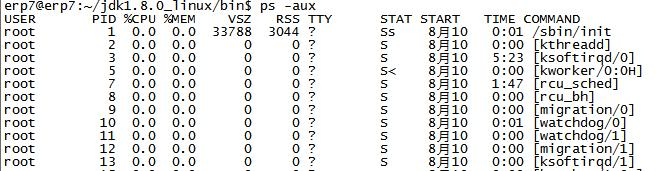

# 常用操作以及概念
## 快捷键
1. Tab：命令和文件名补全；
2. Ctrl+C：中断正在运行的程序；
3. Ctrl+D：结束键盘输入（End Of File，EOF）

## 进程
### 进程查看--ps 命令
ps 支持三种语法风格
+ 示例1 ps -e     显示所有进程
 
+ 示例2 pe -ef    显示所有进程(f:更详细的进程信息,包含父进程的PID)
 
+ 示例3 ps -aux   显示所有进程 (a:显示现行终端机下的所有程序，包括其他用户的程序 u:以用户为主的格式来显示程序状况 x:显示所有程序，不以终端机来区分)
 

ps常利用一个管道符号将进程导向到grep去查找特定的进程
eg.  ps-ef|grep java

### 杀进程--kill 命令
kill <-信息编号> 进程号

kill可将指定的信息送至程序。预设的信息为SIGTERM(15),可将指定程序终止。若仍无法终止该程序,可使用SIGKILL(9)信息尝试强制删除程序。  
只有第9种信号(SIGKILL)才可以无条件终止进程,其他信号进程都有权利忽略。

kill -l 可列出所有信号名称  
常用信号：  
+ HUP     1    终端断线
+ INT     2    中断(同 Ctrl + C)
+ QUIT    3    退出(同 Ctrl + \)
+ TERM   15    终止
+ KILL    9    强制终止
+ CONT   18    继续(与STOP相反,fg/bg命令)
+ STOP   19    暂停(同 Ctrl + Z)

## 文件
### 移动、复制、删除
cp,mv,rm

### 解压缩
#### tar命令

| 扩展名 | 压缩程序 |
| -- | -- |
|\*.tar |  tar 程序打包的数据，没有经过压缩 |
|\*.tar.gz | tar 程序打包的文件，经过 gzip 的压缩 |
|\*.tar.bz2 | tar 程序打包的文件，经过 bzip2 的压缩 |
|\*.tar.xz | tar 程序打包的文件，经过 xz 的压缩 |

这五个是独立的参数，压缩解压都要用到其中一个，可以和别的参数连用但只能用其中一个。  
+ -c: 建立压缩档案
+ -x：解压
+ -t：查看内容
+ -r：向压缩归档文件末尾追加文件
+ -u：更新原压缩包中的文件

必选的参数
-f: 这个参数是最后一个参数，后面只能接档案名。

可选参数

## nohup &
nohup :不挂断地运行命令,标准输出和标准错误默认重定向大当前目录下的nohup.out文件中
&     :在后台运行

command &      :将任务放到后台,关闭xshell,对应的任务也跟着停止.
nohup command  :将sh test.sh任务放到后台,关闭标准输入,终端不再能够接收任何输入(标准输入),重定向标准输出和标准错误,即使关闭xshell退出当前session依然继续运行.
nohup command &: test.sh任务放到后台,但是依然可以使用标准输入,终端能够接收任何输入,重定向标准输出和标准错误,即使关闭xshell退出当前session依然继续运行。