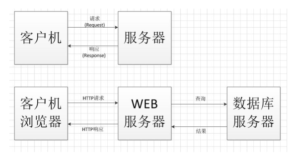

## B/S与C/S架构

​	C/S架构，即 Client/Server(客户机/服务机)结构。通过将任务合理分配到 Client 端和 Server 端，可以充分利用两端硬件优势，实现资源的共享。一般指的是2-tier结构。

​	B/S架构，即 Browser/Server(客户机/服务机)结构。随着 Internet 技术兴起，对 C/S 结构的一种变化和改进的结构。一般指的是3-tier结构。

​	C/S 与 B/S 的概念更偏向于物理层的的划分。

 

## 三层架构与MVC

​	在 B/S 结构中，浏览器负责发出和相应请求，数据库服务器负责接受查询并返回查询结果。这样导致所有的运算处理都集中在web服务器端。为此，我们将web端的事务根据逻辑进行分割，即三层架构。

​	三层结构，指的是界面层(UIL)、业务逻辑层(BLL)、数据访问层(DAL)。

​	

