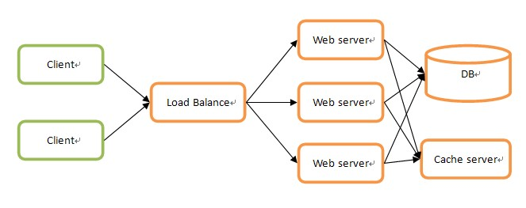
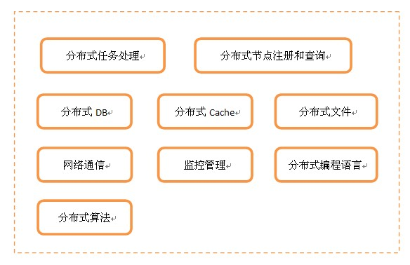

# SSH
SSH(Secure Shell),由IETF网络小组制定，为建立在应用层基础上的安全协议。SSH是目前较可靠的，专为远程登录会话和其他网络服务器提供安全性的协议。

# 正向代理与反向代理（forward proxy, reverse proxy）
首先从生活的角度去理解代理，代理有代别人完成职务的意思。同样，在网络中，代理也是替别人（客户端或服务器）完成某种功能。代理又分为正向代理和反向代理（这些词都是翻译的，原词为forward proxy和reverse proxy）。
正向代理是作为客户端的代理，为客户端服务，同时正向代理应该部署在客户端，在正向代理模式下，真正的服务器只知道请求来自代理服务器不知道实际发生请求的客户端，从而隐藏了真实的客户端，正向代理所起作用是代替用户去访问服务器。
反向代理是作为服务器的代理，为服务器服务，反向代理应该部署在服务器端，返回响应时，客户端只知道响应来自代理服务器不知道实际发生响应的服务器，从而隐藏了真实的服务器，反向代理所起作用是代替服务器来响应客户端的请求。

# 分布式与集群
​	分布式可繁也可以简，最简单的分布式就是大家最常用的，在负载均衡服务器后加一堆web服务器，然后在上面搞一个缓存服务器来保存临时状态，后面共享一个数据库。这种环境下真正进行分布式的只是web server而已，并且web server之间没有任何联系，所以结构和实现都非常简单。

​	有些情况下，对分布式的需求就没这么简单，在每个环节上都有分布式的需求，比如Load Balance、DB、Cache和文件等等，并且当分布式节点之间有关联时，还得考虑之间的通讯，另外，节点非常多的时候，得有监控和管理来支撑。这样看起来，分布式是一个非常庞大的体系，只不过你可以根据具体需求进行适当地裁剪。按照最完备的分布式体系来看，可以由以下模块组成：

+ 分布式任务处理服务：负责具体的业务逻辑处理

+ 分布式节点注册和查询：负责管理所有分布式节点的命名和物理信息的注册与查询，是节点之间联系的桥梁

+ 分布式DB：分布式结构化数据存取

+ 分布式Cache：分布式缓存数据（非持久化）存取

+ 分布式文件：分布式文件存取

+ 网络通信：节点之间的网络数据通信

+ 监控管理：搜集、监控和诊断所有节点运行状态

+ 分布式编程语言：用于分布式环境下的专有编程语言，比如Elang、Scala

+ 分布式算法：为解决分布式环境下一些特有问题的算法，比如解决一致性问题的Paxos算法

​	分布式是相对中心化而来，强调的是任务在多个物理隔离的节点上进行。中心化带来的主要问题是可靠性，若中心节点宕机则整个系统不可用，分布式除了解决部分中心化问题，也倾向于分散负载，但分布式会带来很多的其他问题，最主要的就是一致性。

​	集群是个物理形态，分布式是个工作方式。
​	 分布式是指将不同的业务分布在不同的地方。 而集群指的是将几台服务器集中在一起，实现同一业务。
​	分布式中的每一个节点，都可以做集群。 而集群并不一定就是分布式的。
​	分布式是以缩短单个任务的执行时间来提升效率的，而集群则是通过提高单位时间内执行的任务数来提升效率。

​	分布式：不同的业务模块部署在不同的服务器上或者同一个业务模块分拆多个子业务，部署在不同的服务器上，解决高并发的问题
​	集群：同一个业务部署在多台机器上，提高系统可用性  

# epoll and kqueue
[参考文档](https://www.cnblogs.com/FG123/p/5256553.html)
[参考文档](https://www.cnblogs.com/linganxiong/p/5583415.html)

# 磁盘阵列(Redundant Arrays of Independent Drives，RAID)

​	有“独立磁盘构成的具有冗余能力的阵列”之意。

​	磁盘阵列是由很多价格较便宜的，组合成一个容量巨大的磁盘组，利用个别磁盘提供数据所产生加成效果提升整个磁盘系统效能。利用这项技术，将数据切割成许多区段，分别存放在各个硬盘上。

​	磁盘阵列还能利用同位检查（Parity Check）的观念，在数组中任意一个硬盘故障时，仍可读出数据，在数据重构时，将数据经计算后重新置入新硬盘中。

# typescript
    TypeScript是一种由微软开发的自由和开源的编程语言。它是JavaScript的一个超集，而且本质上向这个语言添加了可选的静态类型和基于类的面向对象编程。
    TypeScript扩展了JavaScript的语法，所以任何现有的JavaScript程序可以不加改变的在TypeScript下工作。TypeScript是为大型应用的开发而设计，而编译它时产生 JavaScript 以确保兼容性。
    TypeScript 支持为已存在的 JavaScript 库添加类型信息的头文件，扩展了它对于流行的库如 jQuery，MongoDB，Node.js 和 D3.js 的好处。
