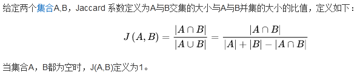

[toc]

## 特例情况

1. 文本含有大量重复字词 A(蓉欧风情公园、长流河工业遗址公园) B(、东山公园、东湖公园)//该情况可以去关键字词回避掉
2. 文本长度差异大 A（成都市青白江区公园概念设计方案（蓉欧风情公园、长流河工业遗址公园、东山公园、东湖公园））B(成都市青白江区公园概念设计方案)

## Jaccard 相似系数

用于比较**有限**样本集之间的相似性与差异性。

### 基本定义

### 适用场景

假设某个业务场景的文本包含了很多重复性的词汇，而这些重复是否与我们想做的任务关系不大，那么在分析文本相似度时，使用Jaccard计算相似度即可，因为对于Jaccard相似度来说，重复不会产生影响。

顺序不影响相似度。

如果两个集合大小相差过多，可能会出现A是B的子集但是相似度却很低的情况。

## cosine相似度

假设这种重复对我们想做的任务影响很大，那么就要使用cosine相似度。